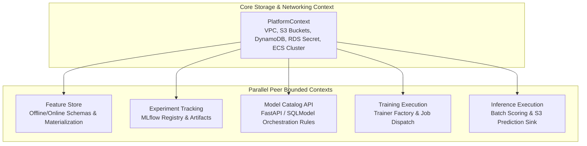

# ML Platform MVP — Product Requirements Document

**Timebox:** 16 hours (built solo, using Antigravity as the dev IDE)
**Goal:** Learn what modules a data/ML platform actually needs and what each tool contributes, by building a real (if minimal) AWS-native stack: AWS CDK for IaC, Feast for feature management, MLflow for experiment tracking and lineage, batch inference now with a clear path to real-time later.
**Guiding constraints:** lowest reasonable cost, AWS-native services only, single AWS account (existing multi-account/SSO setup deferred until CI/CD phase), no monorepo (one component, several logical units).

---

## 1. Scope boundaries

**v1 — single-model pipeline:**
- CDK app with feature store, experiment tracking, training, and batch inference constructs
- Feast: offline store (S3) + online store (DynamoDB) + registry, `feast materialize` wired even though batch inference doesn't strictly need it yet
- MLflow: tracking server (Fargate), Postgres backend store, S3 artifacts, model registry
- Scikit-learn training and batch inference, with an abstraction seam that doesn't block adding PyTorch later
- Minimal CloudWatch monitoring for infra health
- Manual `cdk deploy` via CLI/SSO profile throughout the build

**v2 — multi-model architecture (current active scope):**
- Model catalog (`catalog` schema in existing RDS Postgres) + FastAPI CRUD service for model registration and schedule management (§2.23–§2.24)
- `BaseMLModel` / `Trainer` factory replacing hardcoded single-model constants (§2.25)
- DDD `PlatformContext` dependency injection to decouple all bounded contexts (§2.26)
- Dynamic EventBridge scheduling via API — onboard new models without redeploying CDK (§2.27)
- Two end-to-end use cases demonstrating multi-model dispatch (churn + one additional domain)

**Explicitly out of scope for v1/v2:**
- CI/CD pipeline execution (GitHub Actions + CDK Pipelines scaffolded, wired last or in a later session)
- Custom VPC / private subnets / NAT / ALB
- Real-time inference endpoint
- Model-quality monitoring (drift, accuracy decay)
- Polars dataframe backend
- PyTorch trainer implementation (interface only)

*See §8 for the authoritative v1–v4 versioning table. That table is the canonical "is X in scope" reference.*

---

## 2. Architecture decision log

Each entry: the user story it satisfies, alternatives considered, and what we're building.

### 2.1 Infrastructure as Code

**User story:** As the platform builder, I want the entire platform defined as version-controlled Python code, so any environment is reproducible from `cdk deploy` and changes are reviewable.

| | |
|---|---|
| Alternatives considered | Terraform, manual console setup, CloudFormation directly |
| Decision | **AWS CDK (Python)** |
| Rationale | Native to the AWS best-practices structure being followed; Python end-to-end (same language as Feast/MLflow/ML code); constructs allow logical units to be composed and tested independently |

### 2.2 Repo structure

| | |
|---|---|
| Alternatives considered | Monorepo with independently deployed apps, multi-repo per component |
| Decision | **Single repo, single CDK app, multiple logical-unit constructs** |
| Rationale | One component (the ML platform) with tightly coupled parts that deploy together. AWS CDK guidance recommends splitting repos only once packages are reused across independent applications or owned by separate teams — neither applies here. |

### 2.3 Environment/dependency management

**User story:** As the sole developer, I want one lockfile shared by the CDK app, Feast feature repo, and MLflow client code, so there's no environment drift while moving fast.

| | |
|---|---|
| Alternatives considered | pip + requirements.txt per module, poetry, separate venvs per unit |
| Decision | **uv, single `pyproject.toml` with dependency groups** (`feast`, `mlflow`, `dev`) |
| Rationale | Fast installs, one lockfile, avoids "works on my machine" issues across the three tool surfaces |

### 2.4 Feature store — offline store

**User story:** As a data scientist, I want point-in-time-correct historical features for training and batch scoring, so training-serving skew and label leakage are eliminated.

| | |
|---|---|
| Alternatives considered | Redshift, Athena + Glue Catalog, S3 File source |
| Decision | **S3 File source** (parquet), point-in-time joins computed locally by Feast |
| Rationale | Data volume is small for an MVP; Redshift/Athena add cluster/crawler cost and complexity with no benefit yet. Revisit if data outgrows local join performance. **Crucially, Feast acts as a data access and retrieval layer, not a transformation compute engine.** Domain feature engineering (ETL jobs using Spark, Pandas, or SQL) executes *before* Feast, writing clean, pre-engineered Parquet files to S3 (e.g., `s3://bucket/offline/features/customer_stats.parquet`). Feast simply registers these schemas and performs time-travel joins across datasets without re-executing transformations. |

### 2.5 Feature store — online store

**User story:** As a data scientist, I want a low-latency feature store so features are ready the moment real-time inference exists, without redesigning the feature layer later.

| | |
|---|---|
| Alternatives considered | Skip online store entirely (batch-only), ElastiCache Redis, DynamoDB |
| Decision | **DynamoDB, on-demand billing — provisioned now, `feast materialize-incremental` wired on a schedule** |
| Rationale | On-demand DynamoDB is near-zero cost at idle (pay per request), unlike Redis which bills a node 24/7 regardless of traffic. Provisioning it now costs little and means the real-time extension later is additive, not a redesign. Batch inference still reads from the offline store (the correct pattern for batch); the online store is exercised via materialize now so the muscle memory and infra exist ahead of need. **Furthermore, DynamoDB's schemaless key-value structure generalizes seamlessly to multi-model architectures (N models).** Because Feast serializes composite entity keys into a single string partition key formatted as `<entity_name>#<entity_id>` (e.g., `customer#1004` vs `merchant#552`, see §2.20), multiple distinct datasets and feature views coexist in the exact same DynamoDB table without primary key collisions or database migrations. |

### 2.6 Feature registry

| | |
|---|---|
| Alternatives considered | SQL-backed registry, S3 file registry |
| Decision | **S3 file registry** (single `registry.db` object) |
| Rationale | Zero additional infra; sufficient for a single-writer MVP. |

### 2.7 Experiment tracking & lineage — backend store

**User story:** As an ML engineer, I want every run's params, metrics, and artifacts logged centrally, so I can compare runs, reproduce a model, and register/promote versions.

| | |
|---|---|
| Alternatives considered | Aurora Serverless v2, SQLite on EFS, RDS Postgres fixed instance |
| Decision | **RDS Postgres, `db.t4g.micro`** |
| Rationale | Aurora Serverless v2 has no true zero floor — its minimum ACU runs continuously, making it *more* expensive than a fixed micro instance at this scale despite the "serverless" label. SQLite isn't safe for a shared tracking server (single-writer constraint). |

### 2.8 Experiment tracking — artifact store

| | |
|---|---|
| Alternatives considered | EFS, S3 |
| Decision | **S3** |
| Rationale | No serious alternative — cheap, durable, exactly what MLflow expects. |

### 2.9 Experiment tracking — compute & ingress

| | |
|---|---|
| Alternatives considered | EC2 instance, AWS App Runner, ECS Fargate |
| Decision | **ECS Fargate** (0.25 vCPU / 0.5GB task), **no ALB** — public subnet, task-level public IP, security group locked to the developer's IP |
| Rationale | Fargate is pay-per-second and a better learning target for the ECS module than a raw EC2 box; desired count can drop to 0 between sessions. An ALB adds a ~$16/month fixed cost that isn't justified for a single user in v1 — revisit if HTTPS or multiple concurrent users are needed. |

### 2.10 Networking

**User story:** As the platform builder, I want to know whether isolating traffic from the public internet is actually required for v1, or a premature cost.

| | |
|---|---|
| Alternatives considered | Custom VPC with private subnets + NAT Gateway, default VPC + public subnet + locked-down SG |
| Decision | **Default VPC, public subnet, security group restricted to developer IP** — no custom `networking` construct in v1/v2 |
| Rationale | Feast's S3/DynamoDB calls don't require a VPC at all. Fargate does require *a* subnet, but not a custom one — the account's default VPC suffices. A NAT Gateway (~$32/month) to support private subnets isn't justified yet. Flagged as a v4 hardening item — see §8. |

### 2.11 Monitoring

**User story:** As the platform builder, I want to know if my infra is silently broken (task crash-looping, DB overloaded, table throttling), without building any custom UI.

| | |
|---|---|
| Alternatives considered | No monitoring, full model-quality/drift monitoring, CloudWatch dashboard + alarms |
| Decision | **CloudWatch Dashboard (CDK-defined) + a handful of alarms** (Fargate task health, RDS CPU, DynamoDB throttle count) → SNS → email |
| Rationale | Pure infra health, not model quality. Dashboards are free and alarms are ~$0.10/month each; the CDK construct just declares a widget spec that AWS renders — no UI to build. Model-quality/drift monitoring needs ground-truth feedback loops and is a materially bigger feature — deferred to v2+. |

### 2.12 Training compute

**User story:** As an ML engineer, I want a training job that reads features from Feast, fits a model, and logs everything to MLflow.

| | |
|---|---|
| Alternatives considered | SageMaker Training Jobs, AWS Batch, ECS Fargate task |
| Decision | **ECS Fargate task**, manually or EventBridge-triggered |
| Rationale | Scikit-learn training on small data doesn't need managed training infra or GPUs. Revisit (SageMaker Training or Batch) once PyTorch + GPU workloads arrive. |

### 2.13 Inference compute

**User story:** As the platform owner, I want scored predictions on a schedule now, with a clear, additive path to real-time serving later — confirmed: batch-only for v1/v2, both eventually.

| | |
|---|---|
| Alternatives considered | Always-on serving endpoint (Lambda/SageMaker endpoint), scheduled batch Fargate task |
| Decision | **Scheduled ECS Fargate task** (EventBridge Scheduler, e.g. nightly), reads entities from S3, calls `get_historical_features()` with `event_timestamp = now()`, loads model via `mlflow.pyfunc.load_model`, writes predictions to S3 |
| Rationale | Matches the confirmed batch-first requirement; no ALB, no always-on endpoint, no extra security surface. Real-time path (v2+) adds a second infra shape (Lambda/Function URL or always-on Fargate service) reusing most of `predict.py`, swapping `get_historical_features` for `get_online_features`. |

### 2.14 Model backend abstraction (scikit-learn now, PyTorch later)

**User story:** As an ML engineer, I want to swap training frameworks later without rewriting inference code.

| | |
|---|---|
| Alternatives considered | Hand-rolled `Predictor` interface per framework, `mlflow.pyfunc` as the uniform load/predict interface |
| Decision | **`mlflow.pyfunc.load_model(uri).predict(df)`** as the one inference interface; a small `Trainer` protocol (`fit`, `save`) with `SklearnTrainer` now, `PyTorchTrainer` stubbed |
| Rationale | pyfunc already gives a framework-agnostic predict interface for free — no need to hand-roll one. `fit()` genuinely differs between sklearn and PyTorch, so that seam is worth a few lines of code; the inference seam isn't, since MLflow already solved it. |

### 2.15 Dataframe backend (pandas now, Polars later)

**User story:** As an ML engineer, I'd like to eventually swap pandas for Polars in transformation code.

| | |
|---|---|
| Alternatives considered | Build a `DataFrameBackend` abstraction now, defer until a second backend is actually needed |
| Decision | **Defer** — no abstraction built in v1/v2 |
| Rationale | Feast's public API (`get_historical_features().to_df()`, `entity_df` input) is pandas-native; there's no pluggable dataframe backend inside Feast today. A Polars swap would mean converting at the Feast boundary regardless of any abstraction we add — building the seam now is premature given the 16-hour budget. |

### 2.16 CI/CD

**User story:** As the platform owner, I want infra changes tested and deployed automatically, without that gating the initial build.

| | |
|---|---|
| Alternatives considered | Build pipeline first, build infra first with manual CLI deploys, skip CI/CD entirely |
| Decision | **Defer** — build and test manually via CLI/SSO profile through v1/v2; scaffold `ci.yml` (GitHub Actions: lint, unit test, `cdk synth`) and `toolchain.py` (CDK Pipelines) once functionality is proven |
| Rationale | Matches the existing multi-account SSO setup and avoids debugging pipeline plumbing and infra logic at the same time. |

### 2.17 Antigravity

Not an architecture component — it's the agentic IDE used to build the above. No entry in the deployed stack.

### 2.18 Stack separation — stateful vs. stateless

**User story:** As the platform builder, I want stateful resources (S3, DynamoDB, RDS) protected from accidental destruction when I redeploy or iterate on compute resources.

| | |
|---|---|
| Alternatives considered | Single stack for everything, one stack per logical unit |
| Decision | **Two stacks: `MLPlatformStatefulStack` and `MLPlatformStatelessStack`** |
| Rationale | CDK best practice: group by *deployment boundary*, not by logical domain. Stateful resources (buckets, DynamoDB table, RDS instance) carry `RemovalPolicy.RETAIN`/`SNAPSHOT` and should not be recreated when compute resources change. Separating them means iterating on Fargate task definitions, dashboards, and scheduler rules never risks the data plane. The stateless stack receives CDK cross-stack references from the stateful stack at synthesis time. |

### 2.19 Feature store S3 layout — single bucket, two prefixes

| | |
|---|---|
| Alternatives considered | Two separate S3 buckets (offline store + registry) |
| Decision | **Single bucket, two logical prefixes: `offline/` and `registry/`** |
| Rationale | PRD §2.6 calls for "zero additional infra" for the registry. A single bucket reduces bucket sprawl, simplifies IAM scoping (one ARN with prefix conditions), and avoids S3 cross-bucket permission wiring. IAM policies use `arn:aws:s3:::bucket/offline/*` and `arn:aws:s3:::bucket/registry/*` prefixes to scope access per role. |

### 2.20 Feast DynamoDB online store — key schema

| | |
|---|---|
| Decision | **Single hash key: `entity_id` (String), no sort key** |
| Rationale | Feast serialises its own composite entity key into a single string partition key. Adding a CDK-level sort key would conflict with Feast's internal key management and cause `ValidationException` at `feast materialize` time. The table is created with only the hash key; Feast handles all internal schema beyond that. |

### 2.21 MLflow tracking URI for batch tasks — SSM parameter bridge

| | |
|---|---|
| Decision | **SSM `StringParameter` with placeholder value, referenced by training/inference task definitions via `ecs.Secret.from_ssm_parameter()`** |
| Rationale | The MLflow Fargate task's public IP is dynamic and unknown at `cdk synth` time (no ALB, no Route53 in v1). Rather than hardcode a placeholder env var, an SSM parameter gives a mutable handle: after deploy, retrieve the task IP and run `aws ssm put-parameter --name /ml-platform/sandbox/mlflow-tracking-uri --value http://<IP>:5000 --overwrite`. The next training/inference run-task picks it up automatically. This is a clean dependency-injection pattern for infrastructure. |

### 2.22 EventBridge Scheduler (not EventBridge Rules) for inference

| | |
|---|---|
| Alternatives considered | EventBridge Rules (`aws_events`) + ECS target |
| Decision | **`aws_scheduler.CfnSchedule` (L1)** |
| Rationale | EventBridge Scheduler (2022+) has native first-class support for ECS Fargate tasks including network configuration and overrides in a single resource. The classic EventBridge Rules + ECS target pattern requires a separate ECS-managed `aws_events_targets.EcsTask` construct which carries more implicit IAM surface. Scheduler's `EcsParameters` are more expressive for Fargate network config. No L2 CDK construct for Scheduler yet; L1 (`CfnSchedule`) is used directly. |

### 2.23 Model catalog — storage & schema

**User story:** As the platform builder, I want a queryable catalog of models (schedule, feature view mapping, framework, active status) so the orchestrator can fan out training/inference across a growing set of models without redeploying infra per model.

| | |
|---|---|
| Alternatives considered | New DynamoDB table, flat JSON/S3, MLflow registered-model tags only, new schema in the existing RDS Postgres instance |
| Decision | **New `catalog` schema + tables in the existing RDS Postgres instance** already provisioned for MLflow's backend store. Modeled with SQLModel; schema evolution managed via Alembic migrations rather than ad hoc `metadata.create_all()`. |
| Rationale | Reuses infra already paid for — zero incremental compute/storage cost for the catalog's existence, only a migration. Gains real relational integrity (foreign keys from a model row to its training-run history) that DynamoDB and flat files can't give cheaply. MLflow's registry remains the source of truth for "which model versions exist and which is `@champion`" (PRD §2.14) — the catalog is specifically the orchestration/business layer MLflow doesn't cover: schedule, feature view mapping, `active` flag, owner. A distinct Postgres role scoped only to the `catalog` schema is used for the API's DB connection — it must not reuse MLflow's own DB credentials (ties to the least-privilege theme in §6.5). Each catalog row also stores a reference to its linked MLflow experiment/registered-model name, so the two systems are queryable together without duplicating what MLflow already tracks. |

### 2.24 Model catalog — access layer (CRUD API)

**User story:** As the platform builder, I want a CRUD API on the model catalog now, so the future Streamlit UI and eventual multi-user access have a stable interface to build against, rather than requiring direct DB credentials.

| | |
|---|---|
| Alternatives considered | Direct DB access only (defer any API), FastAPI + SQLModel CRUD service now |
| Decision | **FastAPI + SQLModel CRUD service, deployed now**, on the existing no-ALB / IP-locked-SG / public-subnet Fargate pattern already accepted for MLflow (PRD §2.9) — no VPC/NAT/ALB hardening added in this phase. Routes versioned from the start (`/v1/models/...`) so the eventual Streamlit consumer isn't broken by a later breaking change. |
| Rationale | Confirmed need to prep for future UI/multi-user access, but the actual multi-user/public-exposure trigger (§8, v3) hasn't happened yet — reusing the already-accepted low-cost pattern avoids paying for the ~$50/month VPC+NAT+ALB bundle before it's needed. Incremental cost: one more small Fargate task (~$0/month stopped between sessions, ~$9/month if left running) — not a new cost category, just one more instance of a pattern already in the stack. The catalog API (§2.23) becomes the source of truth for which models are `active` — when EventBridge Scheduler triggers a training or inference run, the launched container reads `MODEL_NAME` from its environment override and resolves its full configuration (feature refs, `Trainer` class, label column) by calling this API or querying the catalog DB directly. |

### 2.25 Training dispatch pattern (multi-model)

**User story:** As an ML engineer with a growing catalog of models, I want each training run to instantiate the right `Trainer` implementation based on the catalog's `model_type`, without a growing if/else chain in `train.py`.

| | |
|---|---|
| Alternatives considered | Manual conditional dispatch inside `train.py`; a parallel abstract-class hierarchy across training, inference, *and* monitoring; a `Trainer` factory/registry scoped to training only |
| Decision | **A `Trainer` registry/factory** (`model_type: str → Trainer subclass`), scoped to **training only**. Inference continues to use `mlflow.pyfunc.load_model` (already framework-agnostic, PRD §2.14). Monitoring remains framework-agnostic — it operates on feature distributions and predictions/labels, not model internals. |
| Rationale | `fit()` genuinely differs across sklearn/PyTorch, so the training-side seam is real, worthwhile work — and now has a concrete driver (the catalog's `model_type` column) rather than being speculative. **Crucially, this is 100% compatible with the `pyfunc` abstraction (§2.14):** inside each `Trainer` subclass (or `BaseMLModel`), the `save()` method wraps the underlying framework model in a standard MLflow `pyfunc` flavor. When batch inference executes (`predict.py`), it never needs to know if the champion model was trained with Scikit-Learn, XGBoost, or PyTorch — it simply calls `mlflow.pyfunc.load_model("models:/<model_name>@champion")` and executes `.predict(df)`. |

### 2.26 Infrastructure Composition & Domain-Driven Design (DDD Bounded Contexts)

**User story:** As the platform architect, I want infrastructure constructs modeled as parallel peer domain bounded contexts rather than sequentially dependent layers, so circular CDK dependencies are eliminated and new stateless APIs can be added without prop-drilling.

| | |
|---|---|
| Alternatives considered | Passing construct instances sequentially (e.g., passing `Training` into `Inference`); monolithic stack with all resources inside one construct |
| Decision | **A lightweight `PlatformContext` data class for dependency injection + DDD Bounded Context separation.** |
| Rationale | Conceptually, Training is *not* passed into Inference, nor is Inference a specialized subset of Training. In Domain-Driven Design (DDD), an ML Platform consists of parallel peer Bounded Contexts: Feature Store (storage/retrieval), Experiment Tracking (metadata/artifacts), Model Catalog (orchestration rules), Training Execution (compute), and Inference Execution (scoring compute). To avoid cyclic CDK dependencies and prop-drilling, `component.py` instantiates a typed `PlatformContext` data class containing only shared infrastructure primitives (`vpc`, `feature_bucket`, `online_table`, `db_secret`, `cluster`). Every construct consumes only `PlatformContext`, remaining completely decoupled from peer constructs. |



### 2.27 Dynamic Model Scheduling via Catalog API (No CDK Redeploys)

**User story:** As the platform owner, I want to add new model inference schedules and retraining rules via REST API without redeploying CDK infrastructure.

| | |
|---|---|
| Alternatives considered | Hardcoding `aws_scheduler.CfnSchedule` resources per model inside CDK (requires `cdk deploy` per new model); Lambda cron dispatcher querying the database every minute |
| Decision | **Generic REST routes (`/v1/models/...`) with dynamic boto3 EventBridge Schedule management.** |
| Rationale | The FastAPI model catalog exposes generic RESTful endpoints (`POST /v1/models`, `PUT /v1/models/{model_name}/schedule`) rather than model-specific routes. To eliminate CDK redeployments when onboarding new models, the FastAPI Fargate service is granted IAM permissions to invoke `scheduler:CreateSchedule` and `events:PutRule`. When a new schedule is configured via API, the service uses `boto3` to dynamically create or update an AWS EventBridge Schedule targeting the shared `InferenceTaskDefinition`, injecting `{"MODEL_NAME": model_name}` as a container environment override. This keeps the platform infrastructure immutable while allowing unbounded model expansion. |

---

## 3. Final project structure

```
ml-platform/
├── app.py                       # CDK entry point — sandbox stack (+ toolchain stack, later)
├── constants.py                 # APP_NAME, account/region per stage
├── cdk.json
├── cdk.context.json              # committed
├── pyproject.toml                # uv-managed, single lockfile
├── uv.lock
├── toolchain.py                  # CDK Pipelines — added when CI/CD phase starts
│
├── src/ml_platform/
│   ├── component.py              # composes all logical units
│   ├── feature_store/
│   │   ├── infrastructure.py     # S3 offline store, DynamoDB online store, registry bucket
│   │   └── runtime/
│   │       └── feature_repo/     # feature_store.yaml, entity/feature view defs
│   ├── model_catalog/
│   │   ├── infrastructure.py     # RDS `catalog` schema/migration trigger, Fargate task + SG
│   │   │                         # (reuses PRD §2.9 pattern — no ALB), scoped DB role
│   │   └── runtime/
│   │       ├── app.py            # FastAPI app, /v1/models CRUD routes
│   │       ├── models.py         # SQLModel table + request/response schemas
│   │       ├── alembic/          # migrations
│   │       └── Dockerfile
│   ├── training/
│   │   ├── infrastructure.py     # Fargate task def, IAM role, manual/EventBridge trigger
│   │   └── runtime/
│   │       ├── train.py          # pulls features, fits model (Trainer protocol), logs to MLflow
│   │       └── Dockerfile
│   ├── inference/
│   │   ├── infrastructure.py     # Fargate task def + EventBridge Scheduler (batch)
│   │   └── runtime/
│   │       ├── predict.py        # get_historical_features(now) -> pyfunc.load_model -> predict -> S3
│   │       └── Dockerfile
│   ├── experiment_tracking/
│   │   ├── infrastructure.py     # RDS Postgres, S3 artifacts, Fargate + SG (no ALB)
│   │   └── runtime/
│   │       └── Dockerfile        # mlflow server image
│   └── monitoring/
│       └── infrastructure.py     # CloudWatch dashboard + alarms + SNS topic
│
├── tests/
│   └── unit/                     # cdk assertions tests, one file per logical unit
│
└── .github/workflows/            # added in CI/CD phase
    └── ci.yml
```

---

## 4. Cost posture (v1/v2)

Everything stoppable is designed to be stopped between sessions:

| Resource | Behavior |
|---|---|
| RDS Postgres `db.t4g.micro` | Fixed low cost while running; stop instance between sessions |
| MLflow Fargate task | Set desired count to 0 when idle |
| Training/inference Fargate tasks | Ephemeral — only run when triggered |
| Model catalog CRUD API (Fargate) | Same pattern as MLflow — set desired count to 0 when idle; ~$9/month if left running continuously, ~$0 stopped between sessions |
| S3 (offline store, artifacts, registry) | Storage-only cost, negligible at MVP scale |
| DynamoDB (on-demand) | Pay-per-request, near-zero at idle |
| No ALB, no NAT Gateway | Removes the two largest fixed-cost line items for a solo MVP — deferred to v3/v4, see §8 |

---

## 5. Extension roadmap beyond v2

See **§8** for the authoritative v1–v4 sequencing table. Items confirmed out of scope through v2:

- Real-time inference: `get_online_features()` path, always-on or on-demand serving compute (Lambda/Function URL or small Fargate service) — v3
- CI/CD: wire `ci.yml` (GitHub Actions) + `toolchain.py` (CDK Pipelines) — v3/v4
- Networking hardening: custom VPC, private subnets, NAT Gateway or VPC endpoints, ALB with HTTPS — v4
- Model-quality monitoring: drift/accuracy decay tracking, requires a ground-truth feedback loop — v3+
- PyTorch `Trainer` implementation (GPU-capable training compute — SageMaker Training or AWS Batch) — v3+
- Polars transformation layer at the Feast boundary — v3+
- Full Data Platform ETL integration (AWS Glue, EMR Spark) — long-term, see `road-to-prod.md §6`

---

## 6. Security concerns

This section documents known security exposure in v1 and the hardening required before any production or multi-user deployment. Cross-reference with `road-to-prod.md §4` for the full hardening roadmap.

### 6.1 Public subnet placement — RDS and MLflow

**Exposure:** Both the RDS instance and the MLflow Fargate task sit in the default VPC's public subnets. While the RDS instance has `publicly_accessible=False` and the security group blocks all inbound traffic from the internet (only allows the MLflow Fargate SG on port 5432), this is "defence in depth" with one layer, not two.

**Risk level:** Low for a solo sandbox. The SG rule is the enforcing boundary; the public subnet placement is an architectural limitation of "no NAT Gateway" in v1.

**v2 hardening:** Private subnets + NAT Gateway or VPC endpoints (S3, DynamoDB, ECR, Secrets Manager, SSM). See PRD §2.10 and roadmap §5.

### 6.2 MLflow UI — developer CIDR restriction

**Exposure:** The `DEVELOPER_CIDR` constant in `constants.py` defaults to `0.0.0.0/0` (open to internet). This **must** be replaced with the developer's actual IP before `cdk deploy`.

**Risk level:** High if left as `0.0.0.0/0` — anyone on the internet can reach port 5000 and read/write MLflow runs and the model registry.

**Mitigation:** Replace `DEVELOPER_CIDR` with `curl ifconfig.me` output appended with `/32` before deploy. The CDK code will emit a `Annotations.of(self).add_warning()` if the value is `0.0.0.0/0`.

**v2 hardening:** ALB + ACM (HTTPS), MLflow built-in auth or Cognito OIDC proxy.

### 6.3 RDS credentials — Secrets Manager (auto-generated)

**Exposure:** RDS password is generated by Secrets Manager and never touches version control. However, any IAM principal with `secretsmanager:GetSecretValue` on the RDS secret can retrieve the plaintext password.

**Mitigation in v1:** The secret's resource policy is not explicitly scoped; only the MLflow task role and the CDK execution role can access it by default IAM policy attachment.

**v2 hardening:** Enable Secrets Manager rotation, add a resource-based policy on the secret scoping `GetSecretValue` to only the MLflow task role ARN.

### 6.4 Container images — no CVE scanning

**Exposure:** Placeholder Dockerfiles install packages via `pip install` at build time with no version pinning or vulnerability scanning. A `pip install mlflow` today may pull in a transitive dependency with a known CVE tomorrow.

**v2 hardening:** Pin all package versions in Dockerfiles, add Trivy/Grype to CI (`cdk synth` gate), enable ECR image scanning.

### 6.5 IAM task roles — overly broad S3 grants

**Exposure:** CDK's `bucket.grant_read_write(role)` grants `s3:*` on `arn:aws:s3:::bucket` and `arn:aws:s3:::bucket/*`. This allows training/inference tasks to list and delete all objects in the feature bucket, not just their designated prefixes.

**v2 hardening:** Replace broad `grant_*` calls with explicit `aws_iam.PolicyStatement` scoped to `bucket/offline/*`, `bucket/registry/*`, and `bucket/predictions/*` as appropriate per role.

### 6.6 Inference task public IP

**Exposure:** Inference Fargate tasks launched by EventBridge Scheduler are assigned a public IP (required for ECR image pull in a public subnet without VPC endpoints). The task is ephemeral but the public IP is live for the duration of the run.

**Mitigation:** The task has no exposed ports — there's no ingress SG rule. The public IP is outbound-only.

**v2 hardening:** VPC endpoints for ECR, S3, and Secrets Manager eliminate the need for a public IP in private subnets.

### 6.8 Removal Policies — Development vs. Production

**Exposure:** During the development phase (v1 and v2), all stateful resources (S3 buckets, DynamoDB online table, RDS Postgres database) are configured with `RemovalPolicy.DESTROY` (and `auto_delete_objects=True` for S3) to ensure clean CDK teardown/iteration without manual deletion overhead or orphaned resource billing.

**Risk level:** Extremely high if deployed to production. A `cdk destroy` or stack recreation would result in permanent data loss of the feature store (historical/online data) and the experiment/artifact tracking metadata.

**v2 hardening:** In production staging and prod accounts, stateful resource removal policies **must** be set to `RemovalPolicy.RETAIN` (and `RemovalPolicy.SNAPSHOT` for RDS).

---

## 7. Open assumptions

- Single AWS account/stage for v1/v2; multi-account rollout deferred to CI/CD phase
- Solo developer/user — security posture (IP-locked SGs, no ALB) reflects that and **must** be revisited before any second user or public exposure (see §6)
- Data volumes small enough that local point-in-time joins (no Athena/Redshift) and a `t4g.micro` RDS instance are sufficient
- `DEVELOPER_CIDR` in `constants.py` **must** be replaced with the actual developer IP/32 before `cdk deploy` — failure to do so leaves the MLflow UI open to the internet (see §6.2)

---

## 8. Versioning roadmap (v1–v4)

Formalizing what was previously an implicit "v1/v2 vs v2+" split, now that scope has grown beyond a single model. This table is the authoritative reference for "is X in scope now" going forward — §1, §5, and §6 should be read as subordinate to it.

| Version | Scope | Networking posture |
|---|---|---|
| **v1** *(current)* | Initial infra: feature store, experiment tracking, single-model training/batch inference, CloudWatch monitoring | Default VPC, public subnet, IP-locked SGs, no ALB/NAT (§2.10) |
| **v2** | Multi-model support: model catalog (§2.23) in the existing RDS instance, catalog CRUD API (§2.24), training dispatch pattern (§2.25), Step Functions orchestration fanning out over catalog-driven model configs (§2.20) | **Unchanged from v1** — catalog API reuses the same no-ALB/IP-locked pattern as MLflow (§2.24). No VPC/NAT/ALB added despite the new service. |
| **v3** | Real-time inference (`get_online_features()` path) + Streamlit UI consuming the catalog API and a real-time predict endpoint | This is the actual trigger for hardening: the catalog API and predict endpoint need real authentication (API key or Cognito) the moment a UI or a second person is a genuine consumer — auth, not networking, is the first thing that changes here. |
| **v4** | Full production hardening | Custom VPC with private subnets, NAT Gateway or VPC endpoints, ALB + ACM (HTTPS), WAF on the public-facing ALB, Secrets Manager rotation enabled, CVE scanning in CI, IAM grants tightened from broad `grant_*` calls to explicit scoped `PolicyStatement`s (§6.3–§6.5). This is the ~$50/month bundle — deliberately deferred until v3's real multi-user/public-exposure need materializes, not paid for preemptively in v2. |

**Note on sequencing:** v3 (UI + real-time) and v4 (hardening) tend to arrive together in practice — the day a real endpoint is exposed to a UI is the day the security posture stops being optional — but they're listed separately because auth (v3) is cheap and can precede full network hardening (v4) by some margin if needed.